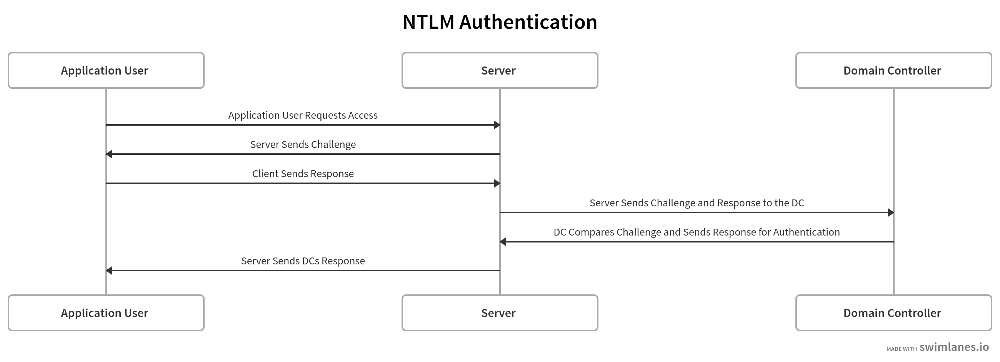

# NTLM_Spray

NTLM_Spray is a Password Sprayer, which attempts to spray password on to the NTLM Login and tries to retrieve usernames.

NTLM_Spray takes the following inputs -

- userfile: txt file containing all the usernames to try brute-force
- fqdn: Fully Qualified Domain Name for the Directory
- password: Password to spray with
- attackurl: URL to attack on

## NTLM Authentication

